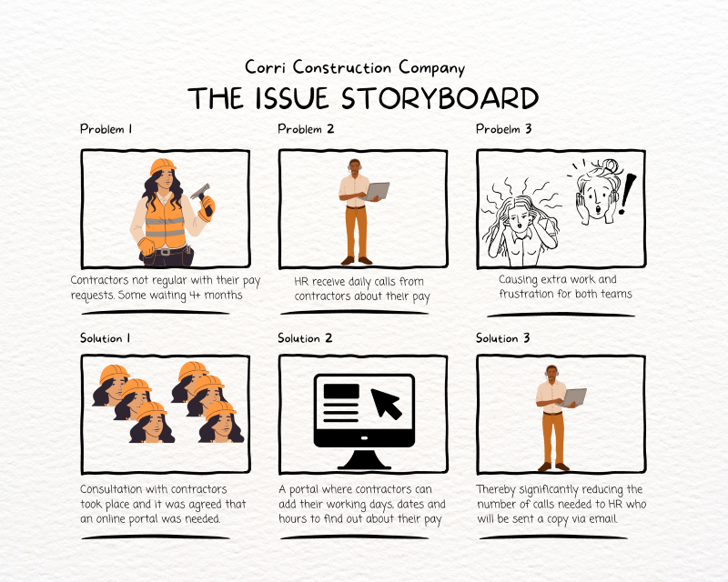

# Corri Construction Company - Contractor Page

The deployed project live link is [HERE](https://corri-construction-p3-e9d1aa627f6f.herokuapp.com/) - ***Press Ctrl (Cmd) and mouse click to open in a new window.***

Corri Construction Company (not their real name!) hires anything from 2 - 300 contractors in a week. HR was inundated with daily calls from contractors asking different questions about their pay. Many developers would store up three to four months of work before submitting their invoices, which caused payroll issues. A consultation took place with the company and contractors to discuss the best way to get regular pay invoices from contractors and to reduce the HR call volume. The end result of the consultation was the request for a portal to be built that will help them manage contractors pay. 

This portal asks contractors to input their name, profession, working dates, number of days worked and number of hours. They are then given a rough estimate of their pay due after tax and NI (which is handled by an umbrella company). The data is forwarded to HR (who extract information for the umbreall company) with a copy also sent to the contractor's email address.

## Project 

The aim of this project is to:

- Reduce the number of calls from contractors to HR asking about their pay.
- Encourge contractors to enter their working dates regularly and within a couple of months.
- Provide a system that will send the information added by the contractor to HR as well as the user.
- Provide clear, visible instructions with each visit.*

Larger storyboard version [here]

*Contractors felt that it was important for the instructions to be shown EACH TIME a contractor visits. In a questionnaire sent out many of them cited their dislike of technology and the fact that they tend to ignore instructions unless they are in front of them. This then results in phone calls to HR that could easily be avoided. For this reason it was decided to leave the instructions in full view each time, rather than hide them behind an instruction button.

### User goals:

Get clear instructions on how to use the system in front of them that they can refer to if needed.
The ability to input their details including dates of work, days, and hours.
Retrieve their employee number.
Get an estimate of tax and national insurance due to be paid.
Receive a copy of the information inputted via email.

### Site owner goals

Provide a program that is easy to use and maintain.
Present a program that gives clear instructions each time a contractor visits.
Get access to the information inputted by users via email.
Develop a program that can have additional features added at a later date.

### Pre development
As the program was being presented in one window I didn't feel the need for a wireframe but did write out the flow of what needed to be included. All I had to do then is follow my notes and code one area at a time before moving on to the next. I set up projects in GitHub to write out work that needed to be done.

My actual notes that created the flow chart

### Development

Code was written for each part of the program starting with the header and input for contractors to add their name. Once each section was working the development of the following section took place. Once all sections had been created testing took place which highlighted the need for additional features.

i.e.
In the "input name" section the user could hit enter and a blank space would be inputted so the first and last names were made required fields. Instructions were written to ensure each user understood the importance of entering their name only. After testing with required fields, the inability to add symbols and numbers was also added.

In the "input dates and hours" section testing highlighted the fact that a user can enter that they worked for just one day but worked 36 hours. Additional coding was added to ensure the maximum number of hours worked in a day was 13 and that applied whether a user worked one day or 10.

## Features

### Slow Typing Instructions
A staggered typing effect was used to display the instructions at the beginning and at different stages of the program at close to reading speed. The sleep effect was used to allow for delays in displaying the next line of information.
This provided time for the user to process the information given before starting to input their details, the hope is that this will result in a reduction in input errors.

### Name and profession input
This feature gives the program the information it needs to find the contractor and connect to their employee number. 

Next. The contractor is asked to select their profession. An error message is displayed if an invalid letter is added:

An opportunity to pick again if the wrong profession was selected has also been given.

### Hourly pay and employee number
Once a contractor has selected their name and profession and confirms the information is correct, the computer brings up confirmation of their hourly pay and contractor number.

### Working dates, days and hours
The contractor is then prompted to add the dates they worked, the number of days and the number of hours. The number of days worked was not originally included in the program but after testing it was added to avoid any confusion about the days a contractor has worked. 

The dates and number of days must match exactly otherwise the user cannot continue to add any further details. This avoids a contractor adding that they worked for 1-08-2023 to 7-08-2023 but they only worked 3 out of those 7 days. The contractor will then have to complete the exact number of days to continue moving forward.

### Confirm information so far

The user will be asked to confirm all the information they have submitted so far before being able to move on. 

If anything needs to change e.g. name, professions, hours, dates etc. the contractor selects n for no.

### Tax and National Insurance
Once all information has been added the program will give a contractor a rough estimate of the tax and national insurance due, which is taken by an umbrella company they joined. The majority of self-employed contractors pay 20% tax or less so it wasn't felt necessary to include a 40% tax option for those earning more than £67,500 in a tax year. This could be added in the future if necessary.

### Confirmation of information

Once the amount before and after tax has been shown the contractor can confirm that they would like this information submitted to HR. HR keep detailed information on the contractors they use and the hours they work. The information submitted is checked by a manager who confirms the working hours and days. Information on tax and NI payments is sent to the umbrella company.

### What the portal checks

A name is inputted and not left blank. Instructions are given to only use letters to avoid a delay in payment.

Profession is chosen from a list of options

The dates (must be within a two month period), the total number of days and hours worked.

As per Working Time Regulations 1998 a maximum of 13 hours are allowed in a day. App checks that less than 13 hours is inputted per day.

Hours can not exceed the dates.

Based on information provided a calculation is made to determine pay before tax and then pay after tax and NI deductions.

The program checks that the user is ready to submit this information. 

If they select yes, they receive confirmation of submission

If they select no, they are invited to re-submit, as shown above.

## Technologies Used

The main technology used to create this program is Python
HTML and CSS to change the background and add social media links.

### Resources

Codeanywhere 
GitHub 
Heroku
Font Awesome
Canva for help with images
miro.com to create flow chart

### Libraries

 - to generate contractor number
)

 - function for delays in typing out lines

## Future Updates

The next update of the app will include the option to choose whether it is their first visit (which will show the instructions) or whether they have used the service before - which will show the instructions behind a button.

The ability to edit information already added if it is incorrect without having to start again.

Contractor can input details of other payments that need to be removed from their pay e.g. student loan or pension.

The program generates an employee number. An update of this app would be to link to a Google sheet where the number is saved so that if they returned and entered their name they will be given the same employee number and their past submissions will be listed.

The ability for a manager to log into the system and confirm working dates and day for each contractor.

Relevant information is accessible by the umbrella company so that HR doesn't have to collate and forward this information.

## Testing

## Validation

## Bugs

After importing the type element so that text can be typed out a line at a time the codes for Fore.WHITE or bold kept showing up e.g. '\033[1m' for bold was typed out. To fix this I had to remove - colorama.init(autoreset=True) - which  meant I had to go through each line of code to ensure if one line was red, all subsequent lines didn't turn red. 

## Credits

Free Code Camp Python for everyone course that helped me get my project started - [here](https://www.youtube.com/watch?v=wgkC8SxraAQ)

py4e autograder to help with checking maths - [here](https://www.py4e.com/tsugi/store/test/pythonauto )

Geek for Geek to help me use strip() to add required field for first/last name - [here](https://www.geeksforgeeks.org/python-program-to-check-if-string-is-empty-or-not/)

Help putting together the function that calculates income tax and national insurance I started with this video and adapated it - [here](https://www.youtube.com/watch?v=b4lok6-_GGg )

To change numerical value to end in two figures only - [here](https://tutorial.eyehunts.com/python/how-to-display-2-decimal-places-in-python-example-code/)

Using colorama import - [here](https://www.youtube.com/watch?v=u51Zjlnui4Y )

Being able to bold and center font - taken from w3Schools - [here](https://www.w3schools.com/python/ref_string_center.asp)

## Acknowledgements

Code Institute women-in-tech group for their support during huddles.

Travis.media community - To help with date/hours/time function so it worked correctly

My mentor